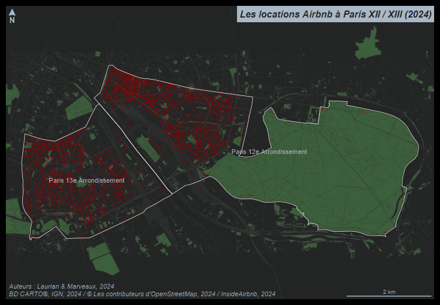
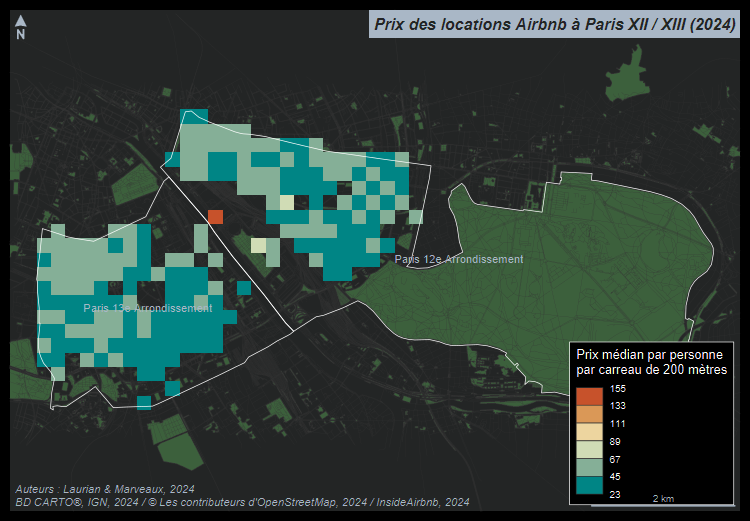

# Évaluation du cours "Géomatique et cartographie avec R" 

## Analyse des prix des locations Airbnb dans les 12e et 13e arrondissements parisiens 

*Antoine Beroud & Louis Laurian*

### Présentation et préparation de l’espace de travail (4 points)

Vous devez tout d’abord télécharger le projet **exam_r** sur votre
machine puis le dézipper.  

Vous devez ensuite renommer le fichier **NOM_Prenom.R** avec vos propres
noms et prénoms.  
C’est ce fichier et **uniquement ce fichier** que vous devrez nous envoyer
avant le **31 janvier 2026**.  

Assurez vous bien que le script fonctionne avant de nous envoyer le
fichier. Pour cela vous pouvez relancer votre session R (ctrl+shift+F10) puis
relancer le script. Vous pouvez aussi faire jouer votre script par l'un ou l'une de vos camarades.

Vous devez apporter un soin particulier à la présentation du code. Il
doit être lisible, aéré, et commenté.

Vous devrez également soigner la présentation des cartes. Faites attention à 
l'othographe et n'oubliez pas les éléments d'habillage nécessaires. 

### Importer les couches d’information et les cartographier (4 points)

Pour ce devoir, vous utiliserez les données du fichier **bnb.gpkg**
contenu dans le dossier **data** du projet **exam_r**.  
Ce fichier geopackage contient 5 couches d’information :

-   **arrdts**, les limites communales des 12e et 13e 
    arrondissements parisiens (BD CARTO®, IGN, 2021),
-   **arrdts**, les limites des IRIS des des 12e et 13e 
    arrondissements parisiens (BD CARTO®, IGN, 2021),
-   **parc**, les espaces verts de la région étudiée (© les
    contributeurs d’OpenStreetMap, 2021),
-   **route**, le réseau viaire de la région étudiée (© les
    contributeurs d’OpenStreetMap, 2021),
-   **rail**, le réseau ferré de la région étudiée (© les contributeurs
    d’OpenStreetMap, 2021),
-   **airbnb**, un extrait des locations Airbnb disponibles
    sur le site www.airbnb.fr en septembre 2024 dans les 12e et 13e
    arrondissements parisiens (InsideAirbnb, 2024)

Ces données ont été téléchargées et processées en amont sur le fichier *Preparation_des_donnees.md*, à titre indicatif.

Vous produirez une carte de la région étudiée en utilisant toutes les
couches d’information disponibles.  
Vous devez exporter la carte dans une figure en PNG ayant une largeur de 800
pixels.   
Attention nous ne demandons pas la carte elle-même, uniquement
le code qui a servi à la produire.</u>

Sur cette carte vous devez faire figurer les limites communales des
arrondissements donnés, les espaces verts, le réseau viaire, le
réseau ferré et les positions des locations disponibles sur le site en
septembre 2024. Vous devrez ajouter à cette carte un habillage complet (flèche
d’orientation, échelle, titre, sources…).

### Carte des locations par IRIS (4 points)

Créez une carte ou le nombre de locations Airbnb par IRIS est indiqué par des
cercles proportionnels.
Exportez cette carte en PNG avec une largeur de 750 pixels.   
Attention nous ne demandons pas la carte elle-même, uniquement
le code qui a servi à la produire.</u>  

### Prix par personne dans le voisinage d'un cinéma (4 points)

Quel est le **prix médian par personne** dans une zone de 600 mètres 
autour du MK2 Bibliothèque ? *Indice : utilisez un outil de géocodage*

### Utilisation d’un maillage régulier (4 points)

Créez un maillage régulier de carreaux de 200 mètres de côté sur les
communes étudiées.  
Comptez le nombre de transaction dans chacun des carreaux.  
Calculez le **prix médian par personne** par carreau.  
Construire un carte représentant le prix médian par carreau en
n’affichant que les carreaux ayant plus de 5 locations.  
Exportez cette carte en PNG avec une largeur de 750 pixels.  
Attention nous ne demandons pas la carte elle-même, uniquement
le code qui a servi à la produire.</u>  
Justifiez la discrétisation utilisée.

